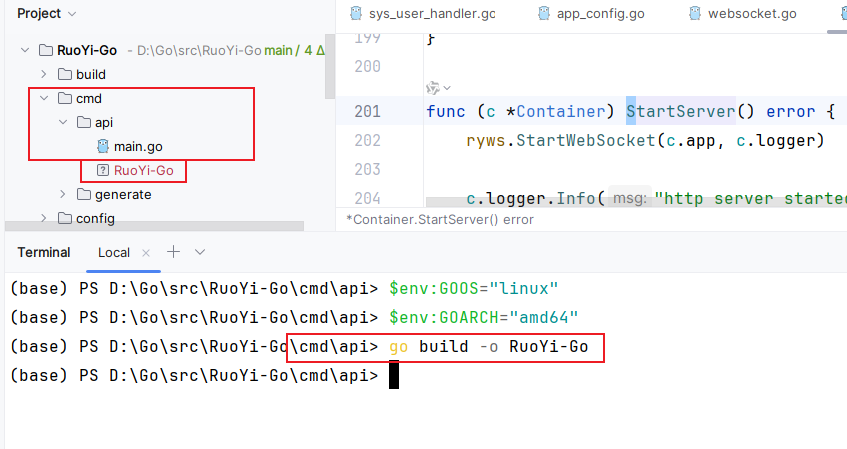
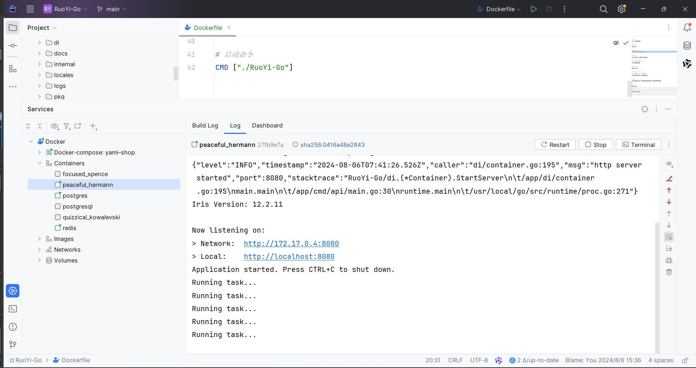
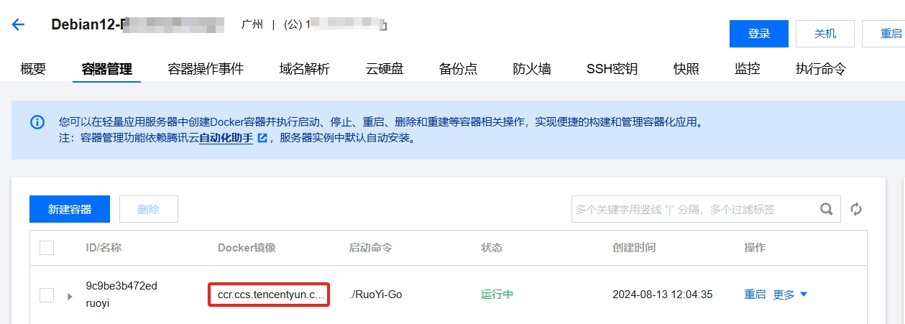
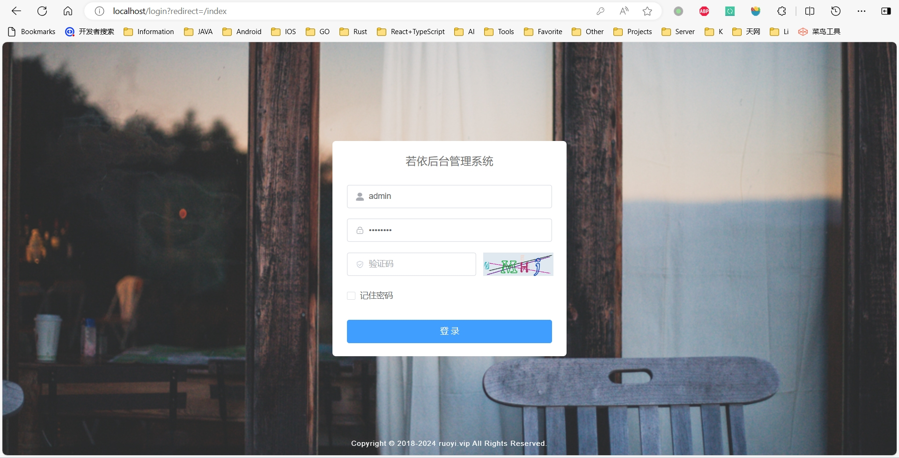
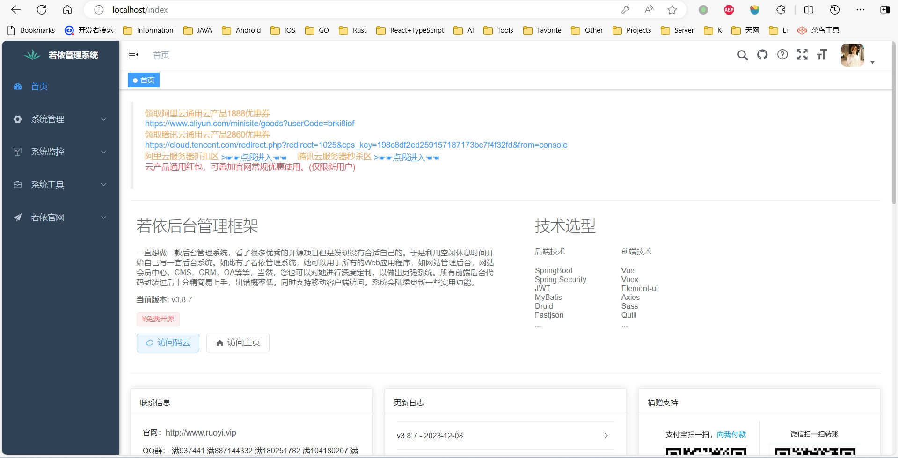
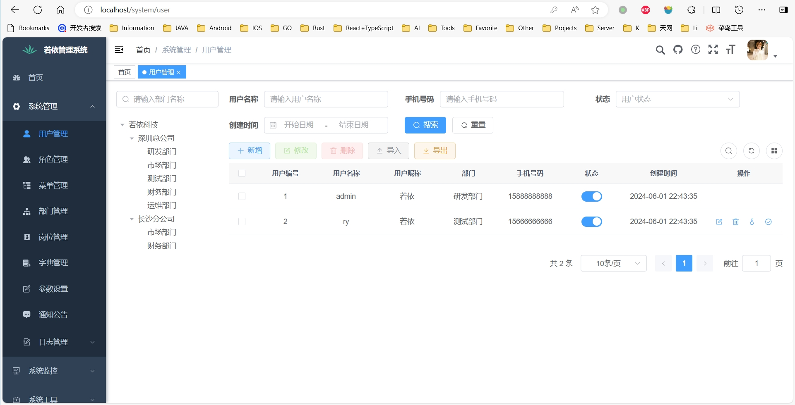

# RuoYi-Go(DDD)

最近好忙，这个开源项目搁置了，非常不好意思  
最近好忙，这个开源项目搁置了，非常不好意思   
最近好忙，这个开源项目搁置了，非常不好意思  

### 1. 关于我(在找远程工作，给机会的老板可以联系)
【个人介绍】在大学期间，我连续三年获得学院奖学金和国家励志奖学金。大二时，我创办了学校的Android俱乐部，并担任第一任社团主席。在大二暑假，我代表学校前往上海的Google公司进行交流学习，并获得了最佳团队奖。从2013年下半年起，我在大学未毕业时便开始实习，从Android开发到iOS开发，再到Spring Boot、Spring Cloud、Go和Python，我熟练掌握了多门开发语言，最终专注于后端和服务器架构。职业生涯从实习生、开发组长、部门主管，一步步发展到研发总监，这期间不仅是技术的积累，更是对产品、业务和架构的深入理解。除了技术方面的积累，在业务层面也有显著的提升。毕业后，我在中山创办了中山GDG（Google Developer Group）谷歌开发者社区，并连续两年兼任中山火炬职业技术学院的外聘老师。同时，我在GitHub社区也有多个开源项目，积极分享和贡献我的技术成果。

【一句话】 我是一名后端开发工程师，工作10年+，开发过Android，IOS，主攻Java+Go+Python，懂服务器架构(Jenkins，Docker，K8s)。  
联系方式：hot_kun@hotmail.com

<br>

### 2. 后端
后端是用Go写的RuoYi权限管理系统 (功能正在持续实现)   
用DDD领域驱动设计(六边形架构)做实践

后端 [GitHub地址](https://github.com/Kun-GitHub/RuoYi-Go)    

后端 [Gitee地址](https://gitee.com/gitee_kun/RuoYi-Go)

<br>

### 3. 前端
本项目没有自研前端，前端代码为 [RuoYi-Vue3 官方前端Vue3版](https://github.com/Kun-GitHub/RuoYi-Vue3)  
推荐用我Fork的这个版本，在开发到后期，我拉了最新的前端，发现最新版前端有很多bug

<br>

### 4. Go后端技术栈（持续在对齐项目，在补充）
<table>
<thead>
<tr>
<th>功能</th>
<th>框架</th>
<th>是否采用</th>
<th>备注</th>
</tr>
</thead>
<tbody>
<tr>
<td rowspan="2">配置管理</td>
<td><a href="https://github.com/spf13/viper">Viper</a></td>
<td>✅</td>
<td>功能丰富，支持动态重载</td>
</tr>
<tr>
<td><a href="https://github.com/kelseyhightower/envconfig">Envconfig</a></td>
<td></td>
<td>轻量级库</td>
</tr>
<tr>
<td>验证码</td>
<td><a href="https://github.com/mojocn/base64Captcha">base64Captcha</a></td>
<td>✅</td>
<td>提供了生成各种类型验证码的功能</td>
</tr>
<tr>
<td rowspan="4">Web</td>
<td><a href="https://github.com/kataras/iris">Iris</a></td>
<td>✅</td>
<td>高性能、灵活且易于使用的Go Web框架</td>
</tr>
<tr>
<td><a href="https://github.com/gin-gonic/gin">Gin</a></td>
<td></td>
<td>快速且高效的Go Web框架</td>
</tr>
<tr>
<td><a href="https://github.com/gogf/gf">goFrame</a></td>
<td></td>
<td>高性能、模块化和企业级的全栈开发框架</td>
</tr>
<tr>
<td><a href="https://github.com/beego/beego">beego</a></td>
<td></td>
<td>全功能的MVC框架</td>
</tr>
<tr>
<td rowspan="3">ORM</td>
<td><a href="https://github.com/go-gorm/gorm">gorm</a></td>
<td>✅</td>
<td>Go语言中一个非常流行的ORM框架</td>
</tr>
<tr>
<td><a href="https://github.com/go-xorm/xorm">Xorm</a></td>
<td></td>
<td>简洁、易用且功能强大的Go语言ORM库，不过没维护了</td>
</tr>
<tr>
<td><a href="https://github.com/volatiletech/sqlboiler">SQLBoiler</a></td>
<td></td>
<td>通过Go的代码生成器来实现的ORM工具</td>
</tr>
<tr>
<td rowspan="3">内存缓存</td>
<td><a href="https://github.com/allegro/bigcache">Bigcache</a></td>
<td></td>
<td>高性能、持久化的键值存储库<br>
适合存储永不过期或者生命周期非常长的数据</td>
</tr>
<tr>
<td><a href="https://github.com/coocood/freecache">freecache</a></td>
<td>✅</td>
<td>高性能的内存缓存库</td>
</tr>
<tr>
<td><a href="https://github.com/golang/groupcache">Groupcache</a></td>
<td></td>
<td>Google开源的一个分布式缓存和缓存填充系统<br>
主要用于大型系统的缓存共享</td>
</tr>
<tr>
<td rowspan="4">日志记录</td>
<td><a href="https://github.com/rs/zerolog">zerolog</a></td>
<td></td>
<td>高性能的结构化日志库，专为JSON输出优化，支持零分配日志记录<br>
适合微服务和云原生应用</td>
</tr>
<tr>
<td><a href="https://github.com/uber-go/zap">Zap</a></td>
<td>✅</td>
<td>高性能、结构化的日志库，特别强调速度和效率<br>
项目配合用了lumberjack，实现日志文件的自动切割和管理功能</td>
</tr>
<tr>
<td><a href="https://github.com/sirupsen/logrus">Logrus</a></td>
<td></td>
<td>以其易用性和灵活性著称</td>
</tr>
<tr>
<td><a href="https://github.com/cihub/seelog">seelog</a></td>
<td></td>
<td>支持复杂的过滤规则、多级日志处理管道和多种输出目标</td>
</tr>
<tr>
<td rowspan="2">依赖注入</td>
<td><a href="https://github.com/google/wire">wire</a></td>
<td></td>
<td>由Google开源的依赖注入工具，它通过代码生成的方式，在编译时期完成依赖注入</td>
</tr>
<tr>
<td><a href="https://github.com/uber-go/dig">dig</a></td>
<td></td>
<td>提供了高性能和可读性，支持构造函数注入、函数参数注入和结构体字段注入</td>
</tr>
<tr>
<td>Redis</td>
<td><a href="https://github.com/redis/go-redis">go-redis/redis</a></td>
<td>✅</td>
<td></td>
</tr>
<tr>
<td>ORM 代码生成工具</td>
<td><a href="https://github.com/go-gorm/gen">go-gorm/gen</a></td>
<td>✅</td>
<td>Friendly & Safer GORM powered by Code Generation</td>
</tr>
<tr>
<td rowspan="2">JWT</td>
<td><a href="https://github.com/golang-jwt/jwt">jwt</a></td>
<td>✅</td>
<td><a href="https://github.com/dgrijalva/jwt-go">jwt-go</a> 衍生版</td>
</tr>
<tr>
<td><a href="https://github.com/lestrrat-go/jwx">jwx</a></td>
<td></td>
<td>实现各种 JWx（JWA/JWE/JWK/JWS/JWT，也称为 JOSE）技术的 Go 模块</td>
</tr>
<tr>
<td rowspan="2">参数校验</td>
<td><a href="https://github.com/go-playground/validator">validator</a></td>
<td>✅</td>
<td>提供了一种优雅的方式来定义和执行各种数据验证规则</td>
</tr>
<tr>
<td><a href="https://github.com/asaskevich/govalidator">govalidator</a></td>
<td></td>
<td>提供了多种内置的验证标签和自定义标签支持</td>
</tr>
<tr>
<td  rowspan="2">主机资源</td>
<td><a href="https://github.com/shirou/gopsutil">gopsutil</a></td>
<td>✅</td>
<td>用于检索系统和进程信息的库，包括CPU、内存、磁盘、网络等信息</td>
</tr>
<tr>
<td>syscall</td>
<td>✅</td>
<td>Go的标准库</td>
</tr>
<tr>
<td  rowspan="2">定时任务</td>
<td><a href="https://github.com/robfig/cron">cron</a></td>
<td>✅</td>
<td>功能强大的库，类似于Unix的cron调度程序。它支持标准的cron语法，并且可以处理秒级的精度。</td>
</tr>
<tr>
<td><a href="https://github.com/ouqiang/gocron">gocron</a></td>
<td></td>
<td>简单而强大的任务调度库，类似于Python的schedule库</td>
</tr>
<tr>
<td  rowspan="2">Excel导入导出</td>
<td><a href="https://github.com/qax-os/excelize">excelize</a></td>
<td>✅</td>
<td>支持读取、写入和管理Excel文件。它支持从Excel 97-2003的.xls格式到现代Excel .xlsx格式的文件。除了基础的数据操作外，还支持样式设置、图表生成等功能</td>
</tr>
<tr>
<td><a href="https://github.com/tealeg/xlsx">xlsx</a></td>
<td></td>
<td>支持读写.xlsx格式的文件。它提供了丰富的API来操作Excel文档，如创建、修改和查询单元格数据等</td>
</tr>
</tbody>
</table>
  
功能模块对应的开源库，还有很多我未知的(基于个人认知局限)，以上只列了一部分，大佬有其他更好的欢迎提issue一起分享试用  

<br>

### 5. 数据库（后面再考虑要不要支持多几个数据库）
<table>
<thead>
<tr>
<th>ORM框架</th>
<th>数据库</th>
<th>是否采用</th>
<th>备注</th>
</tr>
</thead>
<tbody>
<tr>
<td rowspan="3">gorm</td>
<td><a href="https://www.postgresql.org">PostgreSQL</a></td>
<td>✅</td>
<td>支持，但对于若依的前端，Bug比较多</td>
</tr>
<tr>
<td><a href="https://www.mysql.com/">Mysql</a></td>
<td>✅</td>
<td>默认</td>
</tr>
<tr>
<td><a href="https://www.sqlite.org/">Sqlite</a></td>
<td></td>
<td>如果用这个的话，需要重新用gorm生成模型文件<br/>
因为sqlite不知道如何进行字符串转换*time.Time，会报错。</td>
</tr>
</tbody>
</table>

[RuoYi 数据库脚本](https://github.com/yangzongzhuan/RuoYi-Vue/blob/master/sql/ry_20240529.sql)  
[用我备份的数据库脚本](https://github.com/Kun-GitHub/RuoYi-Go/tree/main/db)

<br>

### 6. 项目目录（持续在对齐项目，在补充）
```项目结构
RuoYi-Go/
├── cmd/
│   └── api/
│       └── main.go
├── config/
│   └── config.yaml
├── internal/
│   ├── domain/
│   │   ├── model/
│   │   │   └── demo.go
│   ├── application/
│   │   └── usecase/
│   │       └── demo_usecase.go
│   ├── ports/
│   │   ├── input/
│   │   │   └── demo_service.go
│   │   └── output/
│   │       └── demo_repository.go
│   ├── adapters/
│   │   ├── api/
│   │   │   └── demo_handler.go
│   │   ├── persistence/
│   │   │   └── demo_repository.go
├── di/
│   └── container.go
├── pkg/
│   │   ├── db/
│   │   │   └── database.go
│   │   ├── jwt/
│   │   │   └── jwt.go
│   │   ├── logger/
│   │   │   └── logger.go
│   │   ├── config/
│   │   │   └── config.go
└── go.mod
```

<br>

### 7. 环境(工具)  
[Go 1.22.2](https://go.dev/doc/install) 

[Visual Studio Code](https://code.visualstudio.com/) 神器

[JetBrains Fleet](https://www.jetbrains.com/fleet) （目前还是免费用，类似微软的VS Code，不喜勿喷）
PS:发现暂不支持安装插件，不太好用

[DBeaver Community](https://dbeaver.io/) （SQL客户端和数据库管理工具）

[Another Redis Desktop Manager](https://github.com/qishibo/AnotherRedisDesktopManager) （Redis 客户端）

<br>

### 8. 致谢
致谢 [RuoYi](https://ruoyi.vip)  

致谢以上项目使用到的开源库，不分先后哈   

致谢以上开发用到的工具

<br>

### 9. 缺陷（or TODO）
1. 本项目是纯后端项目，前端是用RuoYi前端，所有为了适配RuoYi前端，有些写法会不太遵循Go语言的规范，不过不影响使用 
2. 当你有每一步都自己写的时候，你会发现若依前端与后端的接口代码\数据真***
3. 定时任务已实现，只是目前只支持无参数形式的定时任务，后续再加可以传参数的
4. 新建用户的时候无法在“添加用户”的弹框里，选择岗位和角色，这个是因为前端接口用/system/user/去接收岗位和角色列表，这个接口又和/system/user/{userId:uint}获取用户信息接口冲突，导致这条接口失效，被重定向。这个是iris暂时没法解决的(有主意的朋友可以帮忙看下)
5. 一些小细节还未实现（总感觉定时任务这里有点问题，有遇到的同学反馈一下）

<br>

### 10. 怎么运行（go版本，1.22.2）
1. 代码运行，拉下代码后，进项目，先执行go mod tidy拉下依赖，成功后运行/cmd/api/main.go
2. Windows系统部署，代码成功运行后，命令行执行 ./build/build.cmd 即可，会得到一个exe，然后在exe同目录下创建config文件夹，然后把config.yaml文件复制进去(代码是这个文件名，但具体文件我没提交，可以拿demo文件修改)，然后运行exe即可
3. Linux系统部署(Docker版)，代码成功运行后，用Dockerfile构建镜像，然后运行镜像即可。同样注意config.yaml配置文件，自己改代码或者改配置文件。  
4. 我已经将我本地的推送到腾讯云公有镜像仓库，后面有时间写个教程（怎么将自己的项目发布到公有仓库），然后再写一个用我的公有镜像仓库的教程，这样大家可以快速部署
5. Linux系统部署(不用Docker),进入main.go对应目录，执行图上的命令，设置临时环境变量，然后执行编译命令。PS: 如果有用到sqlite数据库，命令就不止这样了哈。

Linux  


Docker  
  

腾讯云


<br>

### 11. 代码生成
代码生成这块有新想法，想写另一个项目开源出来：[go_auto_tools](https://github.com/Kun-GitHub/go_auto_tools)     
代码生成这块有新想法，想写另一个项目开源出来：[go_auto_tools](https://github.com/Kun-GitHub/go_auto_tools)     
代码生成这块有新想法，想写另一个项目开源出来：[go_auto_tools](https://github.com/Kun-GitHub/go_auto_tools)   

<br>

### 12. 最后
目前项目还是一个人写，边工作边写，主要是下班后写，所以可能会慢一些哈，如果不介意的话，点个 Start 持续关注，谢谢啦，有什么建议可以提issue哈。

<br>

### 13. 还有一个最后（系统截图）

登录  
  

首页  
  

用户列表  
  

<br>

### 14. 代码
加了一些高并发的案例
